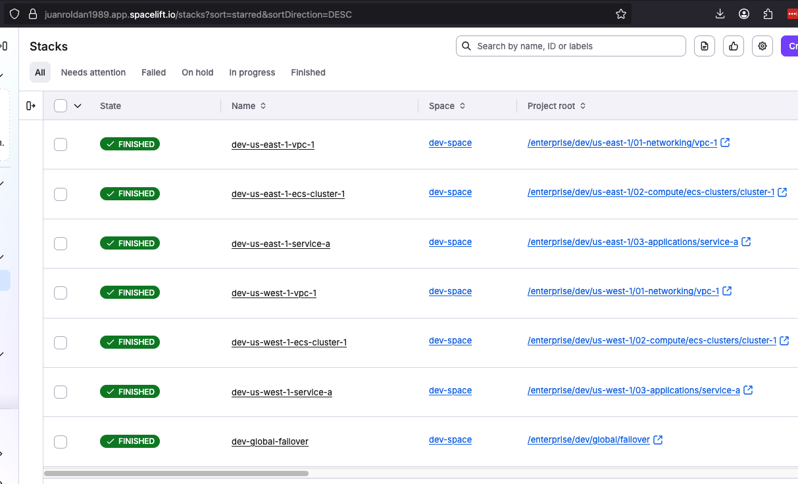
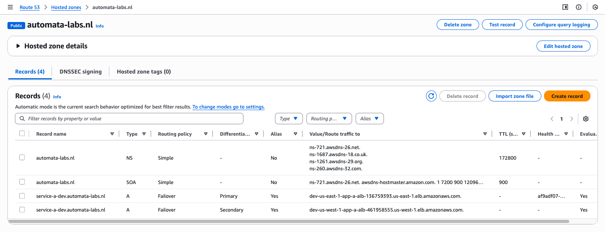

# `DEV` environment - Disaster Recovery

```bash
┌─────────────────────┐    Route 53 DNS Failover    ┌─────────────────────┐
│   us-east-1         │◄───────────────────────────►│   us-west-1         │
│   (Primary)         │                             │   (DR)              │
│                     │                             │                     │
│ ┌─────────────────┐ │      myapp.yourdomain.com   │ ┌─────────────────┐ │
│ │ VPC-1           │ │           │                 │ │ VPC-1           │ │
│ │ 10.0.0.0/16     │ │           ▼                 │ │ 10.10.0.0/16    │ │
│ │                 │ │    ┌─────────────┐          │ │                 │ │
│ │ ┌─────────────┐ │ │    │ Route 53    │          │ │ ┌─────────────┐ │ │
│ │ │ ECS Cluster │ │ │    │ Health Check│          │ │ │ ECS Cluster │ │ │
│ │ │             │ │ │    └─────────────┘          │ │ │             │ │ │
│ │ │ Service-A   │ │ │           │                 │ │ │ Service-A   │ │ │
│ │ └─────────────┘ │ │           │                 │ │ └─────────────┘ │ │
│ │        │        │ │           │                 │ │        │        │ │
│ │ ┌─────────────┐ │ │    Primary Record           │ │ ┌─────────────┐ │ │
│ │ │     ALB     │ │ │◄───(Healthy)                │ │ │     ALB     │ │ │
│ │ │             │ │ │                             │ │ │             │ │ │
│ │ └─────────────┘ │ │    Secondary Record         │ │ └─────────────┘ │ │
│ └─────────────────┘ │     (Failover) ─────────────┼─│►                │ │
└─────────────────────┘                             │ └─────────────────┘ │
                                                    └─────────────────────┘

```

## Benefits of Route 53 Failover Approach

✅ No VPC peering needed - applications are independent
✅ Simpler infrastructure - fewer moving parts
✅ Lower latency - users connect directly to closest/healthy region
✅ Easier testing - can test each region independently
✅ Cost effective - only pay for Route 53 health checks
✅ Standard AWS pattern - well-documented and supported

## Testing Your DR Setup

### Test 1: Verify DNS Resolution

```bash
# Test primary resolution
nslookup service-a-dev.yourdomain.com
# Should return ALB IP from us-east-1

# Test with dig for more details
dig service-a-dev.yourdomain.com +short
```

## Implementation Steps

### Step 1: Domain Registration & Setup

#### Professional Domain Name Options

Choose professional domain: `automata-labs.nl`

#### Register Domain via Route 53

```bash
# Check if domain is available
aws route53domains check-domain-availability \
    --domain-name automata-labs.nl \
    --region us-east-1

# Register domain (replace with your chosen domain)
aws route53domains register-domain \
    --domain-name automata-labs.nl \
    --duration-in-years 1 \
    --admin-contact '{
        "FirstName": "Juan",
        "LastName": "Roldan",
        "ContactType": "PERSON",
        "OrganizationName": "<org-name>",
        "AddressLine1": "<street-address>",
        "City": "Rotterdam",
        "CountryCode": "NL",
        "ZipCode": "<zip-code>",
        "PhoneNumber": "+31.<phone-number>",
        "Email": "<email>"
    }' \
    --registrant-contact '{
        "FirstName": "Juan",
        "LastName": "Roldan",
        "ContactType": "PERSON",
        "OrganizationName": "<org-name>",
        "AddressLine1": "<street-address>",
        "City": "Rotterdam",
        "CountryCode": "NL",
        "ZipCode": "<zip-code>",
        "PhoneNumber": "+31.<phone-number>",
        "Email": "<email>"
    }' \
    --tech-contact '{
        "FirstName": "Juan",
        "LastName": "Roldan",
        "ContactType": "PERSON",
        "OrganizationName": "<org-name>",
        "AddressLine1": "<street-address>",
        "City": "Rotterdam",
        "CountryCode": "NL",
        "ZipCode": "<zip-code>",
        "PhoneNumber": "+31.<phone-number>",
        "Email": "<email>"
    }' \
    --region us-east-1
```

```bash
{
  "OperationId": "23905143-7685-4448-a0f6-422f70b862e8"
}
```

```bash
aws route53domains get-operation-detail \
  --operation-id 23905143-7685-4448-a0f6-422f70b862e8 \
  --region us-east-1
```

```bash
{
  "OperationId": "23905143-7685-4448-a0f6-422f70b862e8",
  "Status": "IN_PROGRESS",
  "DomainName": "automata-labs.nl",
  "Type": "REGISTER_DOMAIN",
  "SubmittedDate": "2025-11-18T20:30:58.925000+01:00",
  "LastUpdatedDate": "2025-11-18T20:32:18.685000+01:00"
}
```

```bash
# List all hosted zones and find your domain
aws route53 list-hosted-zones \
    --query 'HostedZones[?Name==`automata-labs.nl.`].{Id:Id,Name:Name,RecordCount:ResourceRecordSetCount}'

# Get domain details after registration
aws route53domains get-domain-detail \
    --domain-name automata-labs.nl \
    --region us-east-1 \
    --query '{Status: StatusList, NameServers: Nameservers}'

# Get just the hosted zone ID (clean output)
aws route53 list-hosted-zones \
    --query 'HostedZones[?Name==`automata-labs.nl.`].Id' \
    --output text | cut -d'/' -f3
```

### Step 2: Update DR Configuration

```bash
# enterprise/dev/global/failover/terragrunt.hcl
inputs = {
  domain_name    = "service-a-dev.automata-labs.nl"
  hosted_zone_id = "Z1234567890ABC"  # Auto-created with domain registration

  # ... rest of configuration
}
```

### Step 3: Deployment Order

Deploy infrastructure in this specific order:

```bash
# 1. Deploy VPC in us-east-1 (Primary)
cd enterprise/dev/us-east-1/01-networking/vpc-1/
terragrunt apply

# 2. Deploy VPC in us-west-1 (DR)
cd enterprise/dev/us-west-1/01-networking/vpc-1/
terragrunt apply

# 3. Deploy ECS cluster in us-east-1
cd enterprise/dev/us-east-1/02-compute/ecs-clusters/cluster-1
terragrunt apply

# 4. Deploy ECS cluster in us-west-1
cd enterprise/dev/us-west-1/02-compute/ecs-clusters/cluster-1
terragrunt apply

# 5. Deploy Service-A in us-east-1
cd enterprise/dev/us-east-1/03-applications/service-a/
terragrunt apply

# 6. Deploy Service-A in us-west-1
cd enterprise/dev/us-west-1/03-applications/service-a/
terragrunt apply

# 7. Deploy Route 53 failover (global)
cd enterprise/dev/global/failover/
terragrunt apply
```



### Step 4: Verification & Testing Commands

#### Verify DNS Resolution



```bash
# Test primary resolution
aws elbv2 describe-load-balancers --region us-east-1
```

```bash
# Then resolve the ALB DNS name to IPs
nslookup dev-us-east-1-app-a-alb-136759393.us-east-1.elb.amazonaws.com
Server:		100.64.0.2
Address:	100.64.0.2#53

Non-authoritative answer:
Name:	dev-us-east-1-app-a-alb-136759393.us-east-1.elb.amazonaws.com
Address: 35.175.67.127
Name:	dev-us-east-1-app-a-alb-136759393.us-east-1.elb.amazonaws.com
Address: 34.197.155.89
```

```bash
# Compare results from above with Domain resolution
# (should return ALB IP from us-east-1)
nslookup service-a-dev.automata-labs.nl
Server:		100.64.0.2
Address:	100.64.0.2#53

Non-authoritative answer:
Name:	service-a-dev.automata-labs.nl
Address: 35.175.67.127
Name:	service-a-dev.automata-labs.nl
Address: 34.197.155.89
```

```bash
# Test with dig for specific details
dig service-a-dev.automata-labs.nl +short
35.175.67.127
34.197.155.89
```

#### Monitor Health Checks


```bash
# Monitor Route 53 health check status

## Query first health-check result
aws route53 get-health-check-status \
    --health-check-id af9adf07-fe0c-47f7-8091-6f23bb79ddc3 \
    --query 'HealthCheckObservations[0].StatusReport.Status' \
    --output text

Success: HTTP Status Code 200, OK. Resolved IP: 35.175.67.127

## Query all health-checks requests made from different regions
aws route53 get-health-check-status \
    --health-check-id af9adf07-fe0c-47f7-8091-6f23bb79ddc3 \
    --query 'HealthCheckObservations[].StatusReport.Status' \
    --output table

-------------------------------------------------------------------
|                      GetHealthCheckStatus                       |
+-----------------------------------------------------------------+
|  Success: HTTP Status Code 200, OK. Resolved IP: 35.175.67.127  |
|  Success: HTTP Status Code 200, OK. Resolved IP: 35.175.67.127  |
|  Success: HTTP Status Code 200, OK. Resolved IP: 35.175.67.127  |
|  Success: HTTP Status Code 200, OK. Resolved IP: 34.197.155.89  |
|  Success: HTTP Status Code 200, OK. Resolved IP: 35.175.67.127  |
|  Success: HTTP Status Code 200, OK. Resolved IP: 34.197.155.89  |
|  Success: HTTP Status Code 200, OK. Resolved IP: 35.175.67.127  |
|  Success: HTTP Status Code 200, OK. Resolved IP: 34.197.155.89  |
|  Success: HTTP Status Code 200, OK. Resolved IP: 35.175.67.127  |
|  Success: HTTP Status Code 200, OK. Resolved IP: 34.197.155.89  |
|  Success: HTTP Status Code 200, OK. Resolved IP: 35.175.67.127  |
|  Success: HTTP Status Code 200, OK. Resolved IP: 34.197.155.89  |
|  Success: HTTP Status Code 200, OK. Resolved IP: 34.197.155.89  |
|  Success: HTTP Status Code 200, OK. Resolved IP: 34.197.155.89  |
|  Success: HTTP Status Code 200, OK. Resolved IP: 35.175.67.127  |
+-----------------------------------------------------------------+
```

The above means:

```bash
# Health Check Status: ✅ HEALTHY
All regions are reporting "Success: HTTP Status Code 200, OK" which means:

✅ Your primary ALB is healthy and responding
✅ Route 53 is getting HTTP 200 responses
✅ DNS should be pointing to your primary region (us-east-1)

# Multiple Health Check Regions
Route 53 performs health checks from multiple regions for redundancy:

eu-west-1: Success ✅
sa-east-1: Success ✅
us-east-1: Success ✅
us-west-1: Success ✅
```

```bash
# Test application accessibility
curl -I http://service-a-dev.automata-labs.nl/health
```

#### Automated DR Test Script

```
enterprise/scripts/dr-test.sh
```

## DR Metrics to Track

### Key Measurements

- RTO: ~3-5 minutes (Route 53 health check + DNS propagation)

- RPO: 0 seconds (stateless applications) or depends on data sync

- Health Check Interval: 30 seconds

- Failure Threshold: 3 consecutive failures

- DNS TTL: 60 seconds (configurable)

## Cost Estimation

### Annual Costs
```bash
Domain registration (.com): ~$12-15/year
Route 53 hosted zone: $6/year (S0.50/month)
Route 53 health checks: $6/year ($0.50/month)
Route 53 DNS queries: ~$1/year (for testing)
Total: ~$25-28/year
```

### Monthly AWS Resources
```bash
VPC (2 regions): Free
ALB (2 regions): ~$32/month ($16 × 2)
ECS Fargate: ~$30-60/month (depending on usage)
Route 53: ~$1/month
Total Monthly: ~$63-93/month
```

- Adjustment made via Console: CloudWatch Alarm -> "HealthCheckStatus < 1 for 1 datapoints within 1 minute"

- 21:02 - ECS service "A" scaled down to 0 in primary region for testing failover.

- 21:03 - Route 53 detected health check failure with:
-         Failure: HTTP Status Code 503, Service Temporarily Unavailable.

```bash
watch -n 1 "echo '=== Health Check Status ===' && \
aws route53 get-health-check-status \
    --health-check-id af9adf07-fe0c-47f7-8091-6f23bb79ddc3 \
    --query 'HealthCheckObservations[].{Region:Region,Status:StatusReport.Status,Time:StatusReport.CheckedTime}' \
    --output table"
```

- 21:05 - CloudWatch alarm triggered after 1 consecutive periods of 60s each.
- 21:06 - Route 53 switched DNS to secondary (DR) endpoint.
- 21:07 - Verified application accessible via secondary endpoint.

- Total failover time: ~4-5 minutes.
