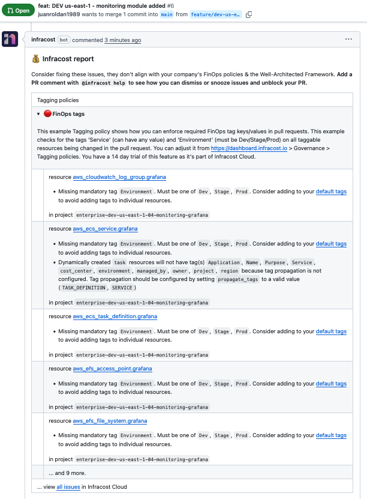
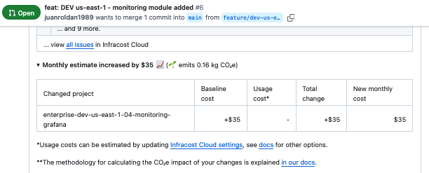

# Infrastructure Cost Analysis

## Overview

This project integrates Infracost to provide comprehensive cost analysis for all pull requests containing infrastructure modifications. The analysis ensures financial transparency and promotes cost-conscious infrastructure decisions.

## GitHub Actions Workflows

### Infrastructure Cost Preview

- **`infra-costs-preview.yaml`** - Automated cost impact assessment for pull requests
  - **Trigger**: Pull request events targeting infrastructure changes
  - **Purpose**: Financial validation and impact assessment prior to deployment
  - **Scope**: Targeted analysis of modified stacks using `--changed` flag
  - **Features**: Comprehensive cost analysis and infrastructure best practices validation

### Implementation Example

The following workflow demonstrates the cost analysis process:

1. **Initial State**: Infrastructure baseline established
2. **Change Request**: Pull request introduces new ECS Service "Grafana" for cluster monitoring
3. **Cost Analysis**: Infracost generates detailed financial impact preview

**Key Analysis Components:**

- **Infrastructure Resource Tagging Compliance**

- **Financial Impact Assessment**

